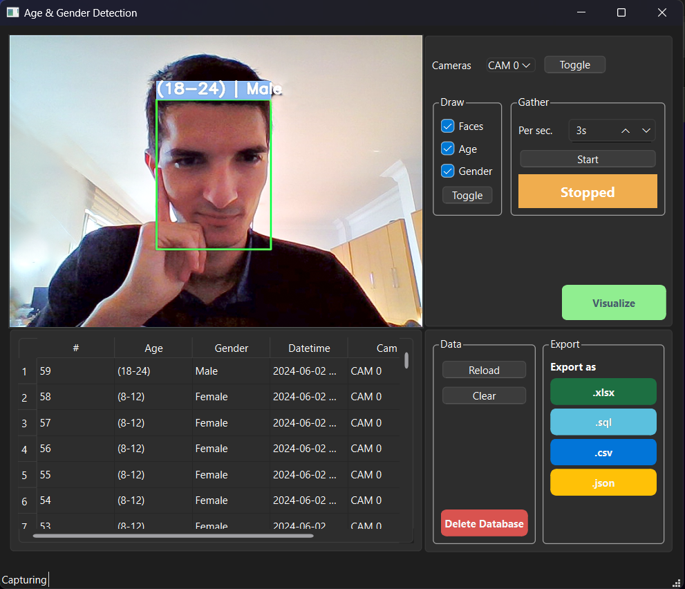
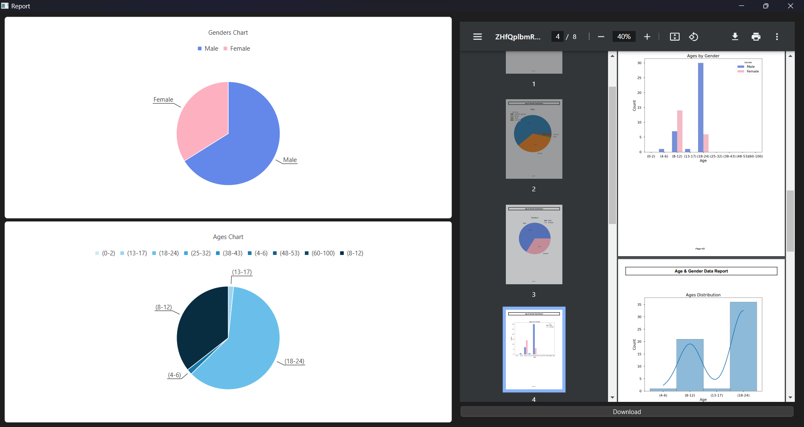

# Age-Gender Data Collector

A Python-based Windows application utilizing OpenCV and PyQt6 to collect age and gender data from a camera. This is my 2nd year Computer Engineering Project II.

## Table of Contents

- [Introduction](#introduction)
- [Features](#features)
- [Installation](#installation)
- [Usage](#usage)
- [File Structure](#file-structure)
- [License](#license)

## Introduction

The Age-Gender Data Collector uses OpenCV for computer vision tasks and PyQt6 for the graphical user interface. It captures age and gender information from individuals through a camera.

## Features

- Real-time age and gender data collection
- Data storage in a SQLite database
- Report generation

## Installation

### Prerequisites

- Python 3.9 or higher
- [pip](https://pip.pypa.io/en/stable/installation/)

### Steps

1. **Clone the Repository**

    ```bash
    git clone https://github.com/emretuncer256/age-gender-data-collector.git
    cd age-gender-data-collector
    ```

2. **Install Required Packages**

    ```bash
    pip install -r requirements.txt
    ```

3. **Verify Pre-trained Weights**

    Ensure the necessary pre-trained weights for age and gender detection are placed in the `weights` folder.

## Usage

Run the application using the following command:

```bash
python main.py
```

1. When application launches, it should look like this:<br>
<p align="center">
  
</p>

2. When you click on the "Visualize" button, a report window will appear.
<p align="center">
  
</p>

## File Structure
```
age-gender-data-collector/
├── weights/                # Pre-trained model weights
├── images/                 # Screenshots of the project
├── .gitignore
├── app.ui                  # PyQt6 UI design file
├── app_ui.py               # PyQt6 UI logic
├── data.db                 # SQLite database
├── data_utils.py           # Data handling utilities
├── db.py                   # Database interactions
├── logger.py               # Logging utilities
├── main.py                 # Main application entry point
├── pdf_viewer.py           # PDF viewing functionality
├── reporting.py            # Report generation
├── requirements.txt        # Python dependencies
├── test_pdf_viewer.py      # Tests for PDF viewer
├── utils.py                # Helper functions
├── LICENSE                 # License
├── report-2024-06-07.pdf   # Sample Report
├── ProjectPaper.pdf        # Project document
└── README.md
```

## License
This project is licensed under the MIT License. See the [LICENSE](LICENSE) file for details.
